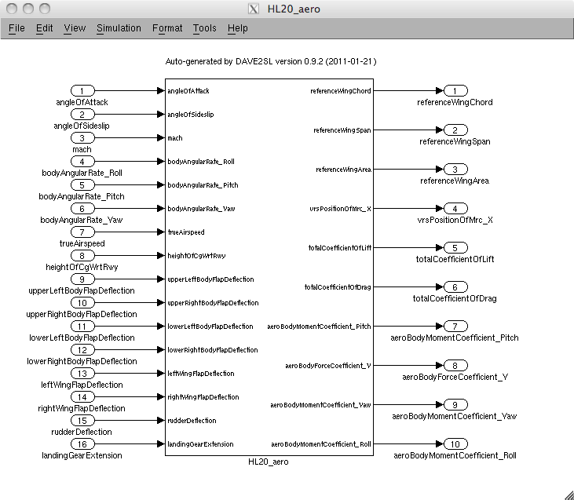
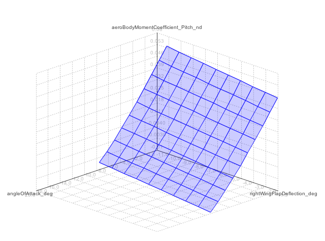

// This file can be turned into XHTML using AsciiDoc

DAVEtools 0.9.7 README
======================
Bruce Jackson, NASA Langley Research Center <bruce.jackson@nasa.gov>
README Version 8, 2015-03-02
:TOC:

Introduction
------------

DAVEtools is a Java package that can be used to operate on DAVE-ML
models; these are XML files with a custom grammar specific to the
exchange of dynamic model data, such as flight simulation physics
models (see link:http://daveml.org[http://daveml.org]). The package is
intended for command-line use as there is no GUI, but the ModelSweeper
tool does use a graphical interface.

use a graphical interface.

Key features of DAVEtools:

* NASA open-source code written in Java
* Validates checkcases within a DAVE-ML models
* Obtains information about a DAVE-ML model
* Allows use of DAVE-ML models from within Matlab(R)
* Converts a DAVE-ML model into a Simulink(R) model, with a validation script
* Plots a 3-D response surface for any output, based on any two inputs
  in a DAVE-ML model

Components
----------
DAVEtools includes three products in one +DAVEtools.jar+ file

.DAVEtools.jar contains:
DAVE::
	Parses a DAVE-ML file (running any embedded verification
	tests) and creates a +Model+ object representing the model
	defined in the DAVE-ML source file. Also can be used to
	provide information about the model and set inputs/get outputs
	from the model.
	This class can be called from within the Mathworks Matlab(R)
	environment to allow use of a DAVE-ML model within the Matlab
	workspace. A demo script is available link:dave_demo.html[here].

DAVE2SL::
	Generates a Matlab(R) script that, when executed in Mathwork's
	Simulink(R) environment, creates a Simulink realization of the
	provided DAVE-ML model. It also creates and runs a
	verification script, if the DAVE-ML model included checkcases.

DAVE2OTIS::
	Generates an OTIS4 input deck (*.dat) and scenario file
	(*.inl)

DAVE2POST:: 
	Generates appropriate POST II table (*.pos2) and model (*.f)
	files.

ModelSweeper::
	Provides a GUI-based tool to inspect the outputs of the
	DAVE-ML model by plotting a 3D response surface of any output
	with respect to a range of values for any two inputs (while
	holding other inputs at nominal values).

Catalogs: Parsing/validating against a local copy of +DAVEfunc.dtd+
-------------------------------------------------------------------

One of the less attractive features of working with XML files is
dealing with the appropriate Document Type Definition (DTD) or XML
Schema Definition (XSD) files, which provide various XML utilities the
rules of grammar for that type of XML file.

DAVE-ML makes exclusive use of the older DTD schema for several
reasons which are out-of-scope of this document. However, DTD rules
are powerful enough to provide adequate validation of a DAVE-ML
file.

These rules are in the +DAVEfunc.dtd+, available for download from
link:http://daveml.org/DTDs/index.html[this page]. This file should be placed
somewhere convenient for you; you might consider putting it in a
central +XML/DTD+ directory on your computer. Unfortunately, there is
no clear consensus on where to place such local copies, and there are
several competing mechanisms available to notify XML-based parsers
(such as used by DAVEtool) where to find appropriate files. The one we
recommend is
link:http://www.oasis-open.org/committees/entity/spec-2001-08-06.html[XML
Catalogs].

If you don't want to download the DTD and set up a catalog file,
DAVEtools will use information found in the DAVE-ML model file (such
as +F106.dml+) to try to fetch the latest DTD over the network at
run-time.  This is much slower than having a local copy of the DTD but
it avoids having to manually download newer copies as the DAVE-ML
specification evolves. If you don't have a network connection, the
DAVEtools will still work but should advise you that the model was
successfully parsed without validation.

If you do want to do 'local' validation, after downloading
+DAVEfunc.dtd+ somewhere convenient, you will also want to download
the tarball +mathml2.tgz+ MathML2 DTD set from
http://www.w3.org/Math/DTD/.  The +mathml2.dtd+ has several related
parts which need to be stored in a particular directory structure
(shown later).

Next, you need to define an *XML catalog* file which will tell DAVEtools
where to find a local copy of these DTDs. 

In the example +catalog.xml+ file listing below, it is assumed that
the DTDs have been stored in a +schemas+ subdirectory under the
working directory:

.Example +catalog.xml+ file
....
<?xml version="1.0"?>
<!-- commented out to prevent network access
     !DOCTYPE catalog PUBLIC "-//OASIS//DTD Entity Resolution XML Catalog V1.0//EN"
    "http://www.oasis-open.org/committees/entity/release/1.0/catalog.dtd" 
-->
<catalog xmlns="urn:oasis:names:tc:entity:xmlns:xml:catalog">
  <group prefer="public" xml:base="schemas">
    <public
	publicId="-//AIAA//DTD for Flight Dynamic Models - Functions 2.0//EN"
	uri="DAVEfunc.dtd"/>

    <rewriteSystem
	systemIdStartString="http://www.w3.org/Math/DTD/"
	uri=""/>

  </group>
</catalog>
....

Continuing with this example, the working directory contents should be
something like what is shown below. The working directory contains a
model file, +F106_aero.dml+ and the +catalog.xml+ file, and a
+schemas+ subdirectory, which is expanded below to show its
contents. Note that all the files in +schemas/mathml2+ were extracted
from the +mathml2.tgz+ tarball:

.Example working directory structure
....
F106_aero.dml
catalog.xml
schemas/
    DAVEfunc.dtd
    mathml2/
        html/
            lat1.ent
            special.ent
            symbol.ent
        iso8879/
            isoamsa.ent
            .
            .
            .
            isotech.ent
        iso9573-13/
            isoamsa.ent
            .
            .
            .
            isotech.ent
        mathml/
            mmlalias.ent
            mmlextra.ent
        mathml2-qname-1.mod
        mathml2.dtd
....

Examples
--------

Shown below are typical use cases for DAVEtools in working with any
DAVE-ML model. The examples all use the aerodynamics model of the
HL-20 lifting body, a concept vehicle studied in the 1980s and 1990s
by NASA as a `space taxi.' This open-source aero model has been
realized in DAVE-ML and is available on the
link:http://daveml.org/examples/index.html#HL-20[examples page]). This database was
used in an approach and landing simulation as described in
link:http://dscb.larc.nasa.gov/DCBStaff/ebj/Papers/TM-107580.pdf[NASA
TM 107580].

.Command aliases 
[NOTE]
=====================================================================
For the following examples (and for general daily use) it is helpful
to define these aliases in your +.cshrc+ or +.bashrc+ file:

+alias *dave*="java -cp 'path_to/DAVEtools.jar'
gov.nasa.daveml.dave.DAVE"+ +
+alias *dave2sl*="java -cp _path_to/DAVEtools.jar_
gov.nasa.daveml.dave2sl.DAVE2SL"+ +
+alias *dave2post*="java -cp _path_to/DAVEtools.jar_
gov.nasa.daveml.dave2post.DAVE2POST"+ +
+alias *dave2otis*="java -cp _path_to/DAVEtools.jar_
gov.nasa.daveml.dave2otis.DAVE2OTIS"+ +
+alias *sweep*="java -cp 'path_to/DAVEtools.jar'
gov.nasa.daveml.sweeper.ModelSweeperUI"+ +
=====================================================================

Simple help
~~~~~~~~~~~
----
$ dave -h
Usage: java DAVE [options] DAVE-ML_document

  where options is one or more of the following:

    --version      (-v)    print version number and exit
    --count        (-c)    count number of elements
    --debug        (-d)    generate debugging information
    --eval         (-e)    do prompted model I/O evaluation
    --list         (-l)    output text description to optional output file
    --internal     (-i)    show intermediate results in calcs and checkcases
    --no-checkcase (-x)    ignore failing checkcases
----

Verify and count elements in a DAVE-ML file 
~~~~~~~~~~~~~~~~~~~~~~~~~~~~~~~~~~~~~~~~~~~
(the example HL-20
aero model is available link:http://daveml.org/examples/index.html#HL-20[here]).
----
$ dave -c HL20_aero.dml
Verified 25 of 25 embedded checkcases.
File parsing statistics:
          Number of variable definitions: 361
        Number of breakpoint definitions: 8
     Number of gridded table definitions: 72
          Number of function definitions: 241
        Number of check-case definitions: 25

              Parsing took 3.383 seconds.

Implementation statistics:
 Number of function interpolation tables: 169
               Number of breakpoint sets: 8
                   Number of data points: 6247

                  Number of signal lines: 741
                        Number of blocks: 751
                        Number of inputs: 16
                       Number of outputs: 10

----

Create a Simulink(R) model
~~~~~~~~~~~~~~~~~~~~~~~~~~
From a command line, the HL-20 aero model creation, verification and
data setup scripts are generated with +dave2sl+:
----
$ dave2sl HL20_aero.dml
Parsing input file...
Parsing successful.
Running verification of internal model...
Verified 25 of 25 embedded checkcases.
Creating MATLAB/Simulink representation...
Simulink model written.
Checkcase data found, generating verification script...
Verification script written.
Wrote both model creation and model setup scripts for HL20_aero.
----

This creates three files:

* +HL20_aero_setup.m+ - loads data into the Matlab(R) workspace in an
                        +HL20_aero_data+ structure

* +HL20_aero_verify.m+ - a script that verifies the resulting
                        Simulink(R) model

* +HL20_aero_create.m+ - a script that builds the +HL20_aero+
                        Simulink(R) model

Invoking the +HL20_aero_create.m+ script at a Matlab(R) prompt yields

----

                            < M A T L A B (R) >
                  Copyright 1984-2010 The MathWorks, Inc.
                Version 7.11.0.584 (R2010b) 64-bit (maci64)
                              August 16, 2010

 
  To get started, type one of these: helpwin, helpdesk, or demo.
  For product information, visit www.mathworks.com.
 
>> HL20_aero_create
Running 25 verification cases for HL20_aero:
 Case 1 passed...
 Case 2 passed...
 Case 3 passed...
 Case 4 passed...
 Case 5 passed...
 Case 6 passed...
 Case 7 passed...
 Case 8 passed...
 Case 9 passed...
 Case 10 passed...
 Case 11 passed...
 Case 12 passed...
 Case 13 passed...
 Case 14 passed...
 Case 15 passed...
 Case 16 passed...
 Case 17 passed...
 Case 18 passed...
 Case 19 passed...
 Case 20 passed...
 Case 21 passed...
 Case 22 passed...
 Case 23 passed...
 Case 24 passed...
 Case 25 passed...

All cases passed: model "HL20_aero" verified.

"HL20_aero" model verified and saved.
>> 
----
This results in a Simulink(R) model, which can be inserted into other
Simulink diagrams. The underlying details are a bit messy, but
functional.

Exercising a DAVE-ML model with Matlab(R)
~~~~~~~~~~~~~~~~~~~~~~~~~~~~~~~~~~~~~~~~~
Even if Simulink(R) is not licensed, the DAVE-ML model can still be
used through Matlab(R) +.m+ scripting. An example script is
link:dave_demo.html[here]. Shown below is an example of the demo
script in action.

----
>> dave_demo
Inputs:
                     angleOfAttack (       deg):      0.0000e+00
                   angleOfSideslip (       deg):      0.0000e+00
                              mach (        nd):      0.0000e+00
              bodyAngularRate_Roll (     rad_s):      0.0000e+00
             bodyAngularRate_Pitch (     rad_s):      0.0000e+00
               bodyAngularRate_Yaw (     rad_s):      0.0000e+00
                      trueAirspeed (       f_s):      0.0000e+00
                  heightOfCgWrtRwy (         f):      0.0000e+00
       upperLeftBodyFlapDeflection (       deg):      0.0000e+00
      upperRightBodyFlapDeflection (       deg):      0.0000e+00
       lowerLeftBodyFlapDeflection (       deg):      0.0000e+00
      lowerRightBodyFlapDeflection (       deg):      0.0000e+00
            leftWingFlapDeflection (       deg):      0.0000e+00
           rightWingFlapDeflection (       deg):      0.0000e+00
                  rudderDeflection (       deg):      0.0000e+00
              landingGearExtension (       deg):      0.0000e+00
Outputs:
                referenceWingChord (         f):      2.8240e+01
                 referenceWingSpan (         f):      1.3890e+01
                 referenceWingArea (        f2):      2.8645e+02
                vrsPositionOfMrc_X (   fracMAC):      5.4000e-01
            totalCoefficientOfLift (        nd):     -5.2619e-02
            totalCoefficientOfDrag (        nd):      5.3106e-02
   aeroBodyMomentCoefficient_Pitch (        nd):      1.5010e-02
        aeroBodyForceCoefficient_Y (        nd):      0.0000e+00
     aeroBodyMomentCoefficient_Yaw (        nd):      0.0000e+00
    aeroBodyMomentCoefficient_Roll (        nd):      0.0000e+00
>> 
----

See all the dirty details
~~~~~~~~~~~~~~~~~~~~~~~~~

Again using the link:http://daveml.org/examples/HL20_aero.dml.zip[HL-20 aero model]
the +-d+ flag gives a blow-by-blow as the model is realized and then
exercised with checkcases.

CAUTION: the +-d+ option will generate a LONG, LONG listing!

----
$ dave -d HL20_aero.dml
Loaded 'HL20_aero.dml' successfully, 
validating against 'file:/Users/bjax/xml/DTDs/DAVE-ML-2.0/DAVEfunc.dtd.'
Root element has 'http://daveml.org/2010/DAVEML' default namespace.

Parsing 361 variable definitions
 --------------------------------

Adding signal 'angleOfAttack' to model.
Adding signal 'angleOfSideslip' to model.
Adding signal 'mach' to model.
Adding signal 'bodyAngularRate_Roll' to model.
Adding signal 'bodyAngularRate_Pitch' to model.
Adding signal 'bodyAngularRate_Yaw' to model.
Adding signal 'trueAirspeed' to model.
Adding signal 'heightOfCgWrtRwy' to model.
Adding signal 'upperLeftBodyFlapDeflection' to model.
Adding signal 'upperRightBodyFlapDeflection' to model.
Adding signal 'lowerLeftBodyFlapDeflection' to model.
Adding signal 'lowerRightBodyFlapDeflection' to model.
Adding signal 'leftWingFlapDeflection' to model.
Adding signal 'rightWingFlapDeflection' to model.
Adding signal 'rudderDeflection' to model.

  .
  .  about 100000 lines removed
  .

Method update() called for output block 'aeroBodyMomentCoefficient_Pitch'
 Input value is 0.015009600000000001

Method update() called for summing block 'plus_444'
 Input #0 value is 0.0
 Input #1 value is -0.0
 Input #2 value is 0.0
 Input #3 value is -0.0
 Input #4 value is 0.0
 Input #5 value is -0.0
 Input #6 value is 0.0
 Input #7 value is -0.0
 Input #8 value is -0.0
 Input #9 value is 0.0

Method update() called for output block 'aeroBodyForceCoefficient_Y'
 Input value is 0.0

Method update() called for output block 'aeroBodyMomentCoefficient_Yaw'
 Input value is 0.0

Method update() called for output block 'aeroBodyMomentCoefficient_Roll'
 Input value is 0.0
Verified 25 of 25 embedded checkcases.
----

Using DAVE2POST or DAVE2OTIS
----------------------------

Both of these tools are invoked similar to DAVE2SL:

----
$ dave2post HL20_aero.dml
----

will generate two POST-II input files: +HL20_aero.pos2+ will contain
data tables in POST-II format, and +HL20_aero.f+ will contain an aero
model snippet in Fortran, suitable for inclusion in POST-II.

----
$ dave2otis HL20_aero.dml
---- 

likewise generates two OTIS4 input files: +HL20_aero.dat+ will contain
data tables in OTIS4 format, and +HL20_aero.inl+ is the input file for
OTIS4 operation (six-dof). Some manual editing of this file will be
needed before execution by OTIS4, including setting the type of
simulation (2DOF, 3DOF, etc) and setting the necessary initial state
values.
 

Using ModelSweeper
------------------

The ModelSweeper tool can be used to examine the
link:http://en.wikipedia.org/wiki/Response_surface_methodology[response
surface] of a DAVE-ML output signal as a function of two inputs.

----
$ sweep
----

will bring up a GUI that allows one to select the input model and
examine the response surface for a particular input, as shown below.

Download
--------
The latest version can be downloaded from the NASA open-source website, 
https://github.com/nasa/DAVEtools .

Changes since V 0.8.1
---------------------
V 0.9.7::
  Added support for simple logic (not, and, or) operations; added
  "ignore checkcase" (-x) option, reduced spacing of blocks to fit in
  larger models in single Simulink model.
  
V 0.9.6:: 
  Changed to use newer PreLookup and Interpolation_n-D blocks;
  corrected most 'if', 'while' statements in source to use braces;
  changed exception handling to deal with syntax errors at a lower
  level; changed order of import statements to make NetBeans happy;
  deprecated +Block.getDests()+ and +Block.getSource()+ in favor of
  +getDestBlocks()+ and +getSourceBlocks()+ to remove ambiguity of
  whether a reference to a +Signal+ or a +Block+ was being retrieved;
  maybe fixed vertical alignment of top-level subsystem?

V 0.9.5:: Changed behavior of -i flag to DAVE; in addition to creating
        an XML snippet with internal values for any checkcase
        successfully passed, will spit out useful intermediate values
        if used with the -e (evaluate) flag. Also fixed a bug in
        creation of N-d tables with dimensions greater than 4.

V 0.9.4:: Added new utilities: DAVE2POST, to generate POST-II input
	decks and code sections; and DAVE2OTIS, to generate OTIS4
	input decks.  Added FORTRAN and C code snippet writers, to
	support these.  Added selectionFlag to Block and
	selectOutput(), getSelectedBlocks() to Model.  Tweaked tests
	to run under Windows XP. Upgraded for use with NetBeans 7.1.1
	and Java SE 1.6. Fixed incompatibility with Matlab/Simulink
	2011b. Bug fix for inequality comparison operator in Simulink
	block.

V 0.9.3:: Added tally of checkcases to DAVE's statistics summary (when
	used with the -c option). Added support for UML diagram
	generation (with two open-source packages) for DAVEtools
	development. Separated this change log from the readme
	file. Fixed some annoyances related to missing DTDs and/or
	network being unavailable. Added support for MathML 'max',
	'min', 'ceiling', and 'floor' elements.

V 0.9.2:: Corrected bug in DAVE that didn't recognize use of binary
        minus in MathML2 calculations; fixed bug whereby anonymous
        tables shared the same matlab setup data; corrected sense of
        return codes from DAVE and DAVE2SL. Improved integration test
        framework. Corrected bug in ModelSweeper that caused program
        to crash if no checkcases were defined.

V 0.9.1:: Added support for minValue and maxValue attributes of
        variableDef as allowed in DAVE-ML 2.0 RC 4; fixed error
        reporting in creation script generation (aborts were returning
        exit status 0 but now report 1).

V 0.9.0:: Changed to support the default DAVE-ML namespace (xmlns);
	added entity refs to make Eclipse IDE happy; changed for using
	'build' subdirectories to 'bin' to make Eclipse convention;
	fleshed out ant build.xml file to rely less on makefiles (but
	a makefile is still needed to run the app_tests of DAVE2SL).
	Corrected the inability of dave to parse MathML 'piecewise'
	elements with more than one 'piece.'
 	Distribution format switched to zip from tar to be more PC
 	friendly.
	Build system switched to Ant from Make (but some hybrid make
	functionality exists, to some version of make is still
	required).
	Source code management system now uses 'git' instead of
	Subversion.
	Now producing a single DAVEtools.jar that includes all
	products for convenience, including dave, dave2sl, modelsweeper,
	xerces and jdom .jar file contents. Slightly different syntax
	used to invoke DAVE2SL (default jar entry point) and DAVE.

